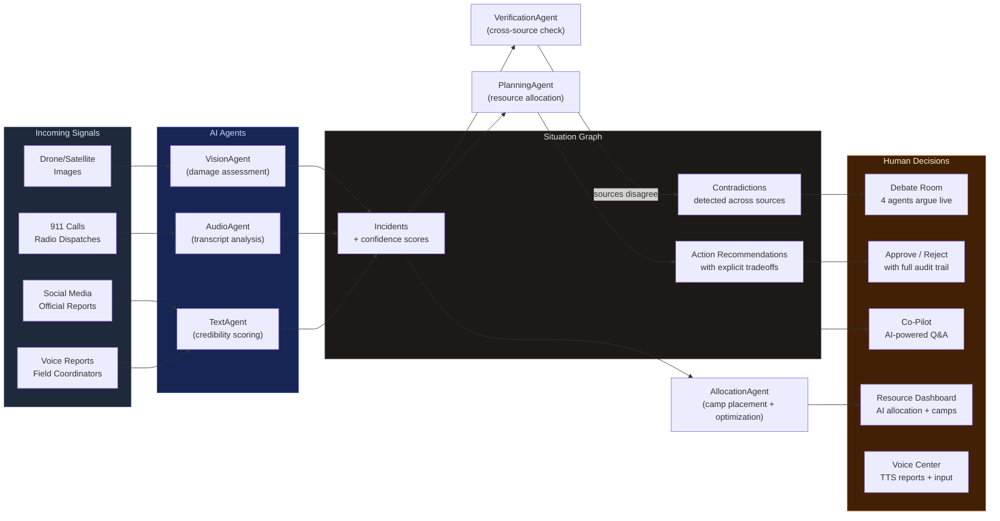

# CrisisCore

**Multimodal, Multi-Agent Disaster Response Coordination with Epistemic Transparency**

> When a 6.8 earthquake hits, contradictory reports flood in simultaneously. A satellite shows a bridge intact. A first-responder says it collapsed. Social media is hysterical. CrisisCore uses 8 specialized AI agents to process the chaos, surface the contradictions, and let human operators make auditable decisions with explicit tradeoffs.

Built for the **Columbia AI for Good Hackathon** — a hackathon focused on using AI to tackle real-world humanitarian and social impact challenges.

---

## The Core Insight

Most disaster AI hides uncertainty. CrisisCore **surfaces it**.

When agents disagree, the system doesn't pick a winner — it shows the disagreement, lets agents debate it live, and gives the human operator everything they need to decide.

---

## How It Works



---

## Five Views, One System

### 1. Command Dashboard
The main operational view. Six panels show the full picture at a glance:

- **Signal Intelligence** — AI real-time analysis of each incoming signal (images, audio, text) with per-source confidence scores
- **Situation Map** — Leaflet map with live incident markers, resource positions, and sector overlays
- **Decision Queue** — Contradictions and action recommendations ranked by urgency, with explicit tradeoffs
- **Evidence Flow** — ReactFlow graph showing how signals connect to incidents, contradictions, and decisions
- **Resource Status** — Ambulances, fire trucks, SAR teams, helicopters — all trackable
- **Event Timeline** — Chronological audit trail of every event and decision

### 2. Debate Room
When two sources contradict each other, click **"Watch Agents Debate"** to open a live, multi-turn argument between 4 AI agents:

| Role | What it does |
|------|-------------|
| **Defender** | Argues for Claim A with evidence and reasoning |
| **Challenger** | Argues for Claim B, poking holes in Claim A |
| **Rebuttal** | Responds to the Challenger, integrating new evidence |
| **Synthesis** | Weighs both sides and produces a final confidence-scored verdict |

Each turn streams to the UI in real time. After the synthesis, the operator can **Accept Claim A**, **Accept Claim B**, or **Request Aerial Verification**.

### 3. Resource Allocation Dashboard
AI-powered post-disaster resource management:

- **Resource Inventory** — Sortable/filterable table of all units (ambulances, fire engines, SAR teams, helicopters)
- **AI Allocation Plans** — Click "Generate AI Plan" and the system suggests optimal resource-to-incident assignments with rationale
- **Camp Location Finder** — Click "Suggest Camp Locations" to get AI-recommended relief camps, rescue staging areas, and medical triage points placed on the map
- **Approve/Reject** — Human-in-the-loop approval for every suggestion

### 4. Voice Command Center
Voice-powered field coordination:

- **Situation Reports (TTS)** — AI generates a spoken briefing of the current situation, read aloud via ElevenLabs text-to-speech
- **Voice Input** — Field coordinators record voice reports using browser speech recognition; transcripts are automatically processed into the situation graph
- **Report History** — All voice reports logged with timestamps and source camp info

### 5. Operator Co-Pilot
A conversational AI interface with full access to the situation graph. Ask questions like:

- *"What's the highest-risk area right now?"*
- *"Should I reroute ambulances from Sector 1?"*
- *"What's our hospital capacity situation?"*

AI answers with specific incident IDs, confidence levels, and resource references — not generic advice.

---

## The Eight Agents

| Agent | Role | Input | Output |
|-------|------|-------|--------|
| **VisionAgent** | Damage assessment, casualty estimation | Drone/satellite imagery | Damage level, trapped indicators, access routes |
| **AudioAgent** | Transcript analysis, urgency classification | 911 calls, radio dispatches | Incident type, persons involved, resource requests |
| **TextAgent** | Credibility scoring, claim extraction | Reports, social media | Claims with confidence, source credibility |
| **VerificationAgent** | Cross-source contradiction detection | Multiple claims about same entity | Verdict (contradiction/consistent), temporal analysis |
| **PlanningAgent** | Resource allocation with explicit tradeoffs | Full situation graph | Recommendations with tradeoffs and uncertainty factors |
| **TemporalAgent** | Confidence decay, situation projection | Time-series observations | Projected state, staleness flags, refresh priorities |
| **AllocationAgent** | Post-disaster resource optimization + camp placement | Full graph state | Optimal assignments, camp location suggestions |
| **DebateAgent** | Multi-turn structured debate orchestration | Contradiction alert | 4-turn argument with final verdict |

Every agent has a **fallback mode** with realistic pre-built scenarios so the demo works even without an API key.

---

## Demo Scenario: Metro City 6.8 Earthquake

The simulation plays out 15 events in ~30 seconds:

| Time | Event | What Happens |
|------|-------|-------------|
| T+5s | Drone image | Severe pancake collapse at 500 Market Street |
| T+8s | Social media | Panicked tweets confirm the collapse |
| T+12s | Radio dispatch | First responder reports 5+ trapped, requests SAR |
| T+15s | Drone image | Active fire spreading in Sector 3 |
| T+18s | Hospital report | Metro General at 45% ER capacity |
| T+22s | 911 call | Family of 4 trapped on 3rd floor, Oak Street |
| T+32s | **Contradiction** | Bridge: satellite says intact, radio says collapsed |
| T+38s | **Contradiction** | Casualties: field says 12-15, hospital says only 3 received |
| T+46s | **Contradiction** | Gas line: sensors say nominal, civilian reports gas smell |
| T+55s | Aerial verify | HELI-1 confirms bridge collapse |
| T+68s | 911 transcript | Second report of trapped family, corroborates first |
| T+120s | **Aftershock 4.2M** | Confidence levels decay across all incidents |
| T+125s | Ground camera | Secondary collapse in Sector 3 |
| T+130s | Utility alert | Gas leak confirmed at Oak/Elm intersection |

---

## Architecture

```
backend/
├── main.py                  # FastAPI entry + lifespan
├── config.py                # Pydantic settings
├── agents/
│   ├── base_agent.py        # BaseAgent ABC (async Gemini API + fallback)
│   ├── vision_agent.py      # Multimodal image analysis
│   ├── audio_agent.py       # Audio/transcript processing
│   ├── text_agent.py        # Text credibility + claim extraction
│   ├── verification_agent.py # Cross-modal contradiction detection
│   ├── planning_agent.py    # Resource allocation with tradeoffs
│   ├── temporal_agent.py    # Confidence decay + projection
│   ├── debate_agent.py      # 4-turn structured debate orchestrator
│   └── allocation_agent.py  # Resource optimization + camp placement
├── graph/
│   ├── schemas.py           # 30+ Pydantic models
│   └── situation_graph.py   # In-memory graph with audit log
├── orchestrator/
│   ├── coordinator.py       # Main orchestration + signal routing
│   ├── deliberation.py      # Deliberation support logic
│   └── simulation.py        # Demo scenario playback engine
├── api/
│   ├── routes.py            # REST endpoints
│   ├── websocket.py         # Real-time broadcast to all clients
│   ├── copilot.py           # Conversational AI endpoint
│   ├── resources.py         # Resource allocation + camp management
│   └── voice.py             # ElevenLabs TTS + voice transcription
└── demo_data/
    ├── assets/                  # Images & audio for demo scenarios
    ├── scenario_earthquake.json
    └── scenario_hackathon_demo.json

frontend/
├── src/
│   ├── App.tsx              # Router + WebSocket handler
│   ├── components/
│   │   ├── layout/          # Dashboard, Header, Panel
│   │   ├── signals/         # SignalIntelligence (per-modality cards)
│   │   ├── decisions/       # DecisionQueue, ContradictionCard, ActionCard
│   │   ├── map/             # MapView (Leaflet)
│   │   ├── evidence/        # EvidenceFlow (ReactFlow)
│   │   ├── resources/       # ResourcePanel + hospital capacity
│   │   ├── timeline/        # EventTimeline
│   │   └── shared/          # ConfidenceBadge, UrgencyBadge, Countdown
│   ├── pages/
│   │   ├── DebatePage.tsx   # Live agent debate room
│   │   ├── CopilotPage.tsx  # Conversational co-pilot
│   │   ├── ResourcesPage.tsx # Resource allocation + camp finder
│   │   └── VoicePage.tsx    # Voice command center
│   ├── hooks/
│   │   ├── useSituationGraph.ts  # Zustand store (full app state)
│   │   └── useWebSocket.ts       # Auto-reconnecting WebSocket
│   └── types/
│       ├── index.ts         # Core domain types
│       ├── debate.ts        # Debate turn types
│       └── speech.d.ts      # Browser Speech Recognition types
```

---

## Tech Stack

| Layer | Technology |
|-------|-----------|
| AI | Google Gemini 2.0 Flash |
| Voice | ElevenLabs TTS API |
| Backend | Python, FastAPI, Pydantic v2 |
| Real-time | WebSocket (native FastAPI) |
| Frontend | React 18, TypeScript (strict), Tailwind CSS, Vite |
| Map | Leaflet + react-leaflet |
| Flow visualization | React Flow |
| State management | Zustand |

---

## Quick Start

### Prerequisites
- Python 3.9+
- Node.js 18+
- Google Gemini API key
- (Optional) ElevenLabs API key for voice TTS

### Setup

```bash
# 1. Add your API keys
cp backend/.env.example backend/.env
# Edit backend/.env and add your GEMINI_API_KEY (and optionally ELEVENLABS_API_KEY)

# 2. Backend
cd backend
python3 -m venv venv && source venv/bin/activate
pip install -r requirements.txt
uvicorn main:app --reload --port 8000

# 3. Frontend (new terminal)
cd frontend
npm install
npm run dev
```

Open **http://localhost:5173** and click the **Play** button.

---

## Key Design Decisions

- **Non-blocking API calls**: All Gemini calls use `asyncio.to_thread()` so the event loop stays responsive during long API responses
- **Fire-and-forget simulation**: Signal events dispatch as background tasks — the simulation pacing is independent of API latency
- **Graceful degradation**: Every agent has a `get_fallback_output()` with realistic pre-built data, so the demo works without an API key
- **Optimistic UI updates**: Approve/Reject buttons update locally before the server confirms, so the UI feels instant
- **Per-message error handling**: WebSocket errors in individual message handlers don't disconnect the client
- **Voice integration**: Browser Speech Recognition for input, ElevenLabs for high-quality TTS output
- **AI-driven camp placement**: Allocation agent considers incident proximity, hazard distances, road accessibility, and hospital coverage

---

## License

MIT
